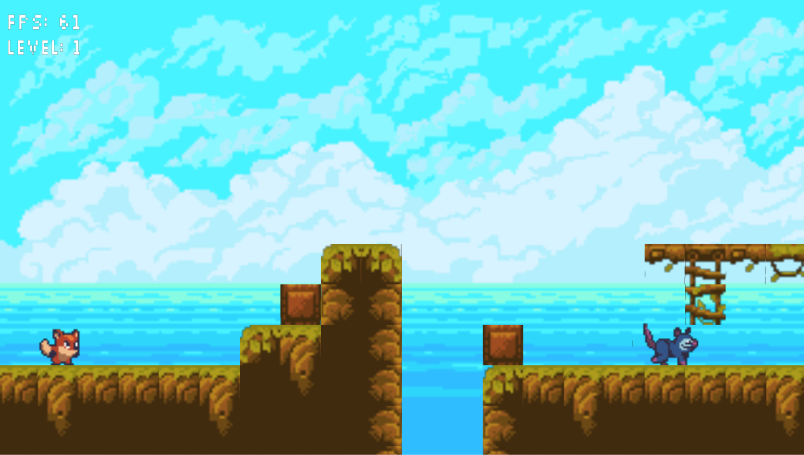
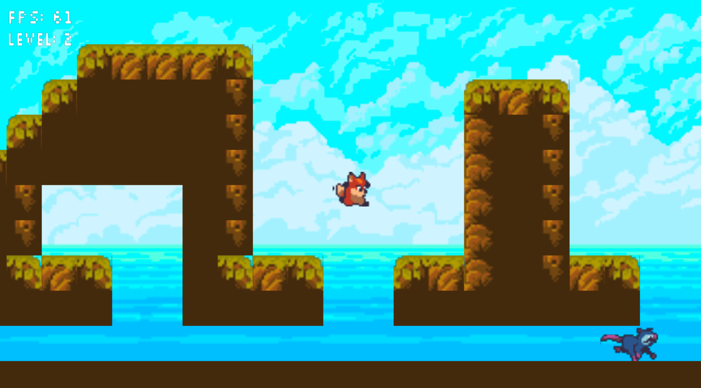
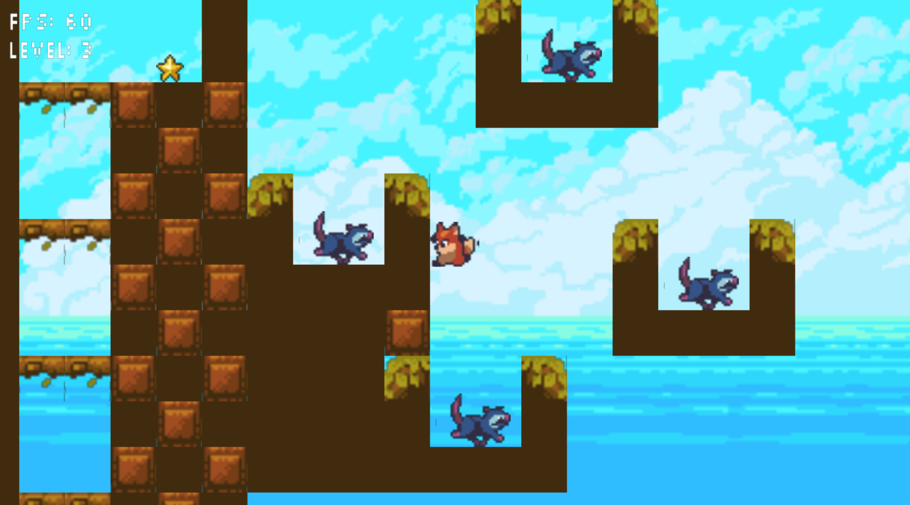

# Platformer! by AR^3

## Download!

[Click here to download!](https://drive.google.com/open?id=1RyRBxyeipKU3nFWebxe0tclFypnvkZHN)

## Documentation
[Click here for documentation](Docs/html/index.html)

## Gameplay Trailer

<iframe width="560" height="315" src="https://www.youtube.com/embed/teMcZRQ9Lc8" frameborder="0" allow="accelerometer; autoplay; encrypted-media; gyroscope; picture-in-picture" allowfullscreen></iframe>

## Screenshots

## Platformer Post Mortem
Overall, we think the project went pretty well. There was a bit of struggle with SDL throughout the process with the Windows users in the group, but our team adapted well to the situation. Part one of the project was heftier than we anticipated, but by pooling together resources we each had utilized in the Breakout project, a lot of the tasks were made somewhat simpler. We worked well together and had a lot of fun with the more creative design choices, like the sprites we use, the music we made, and our special feature: a float jump like Peach and Daisy's from Super Smash Bros. 

Given more time, we would have really liked to work more on the UI to create a better and more clear playing experience for the player. Adding lives, a timer, or expendable power-ups could have been fun additions to the game to add more levels of play. We also would have loved to continue to create more levels, as well as implement some more enemy types, or just something else to make combat a little more complex than the classic "jump on an enemy" mechanic (flying enemies, or enemies that track a player would have been a fun challenge to implement). The idea of an "Enemy Editor" that was a more functional version of the Sprite Editor could have been really interesting, as well. It could have allowed the player to create their own enemy, with a pool of sprites to choose from, and some other options that could make an enemy easier or more difficult.

### Team Platformer
- Ryan Teng
- Roger Chen
- Andrew Alcala
- Raymond Namar
